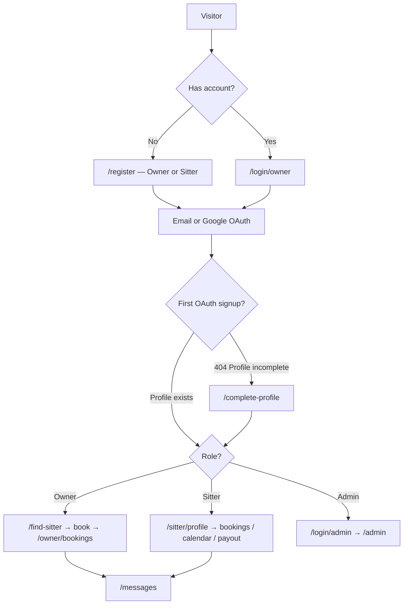

# 📌 Sitter* — Pet Sitter App (Frontend)

> Web client for a pet-sitting marketplace — pet owners find sitters, book services, chat, and pay; sitters manage bookings and payouts; admins moderate the platform.

[]()
[]()
[]()

**Live:** https://pet-sitter-app-client-khaki.vercel.app  
**API:** https://pet-sitter-app-server.onrender.com  
**Backend repo:** [Kaopan11/pet-sitter-app-server](https://github.com/Kaopan11/pet-sitter-app-server)

---

## 📖 Table of Contents

- [Features](#-features)
- [Website Flow](#-website-flow)
- [Tech Stack](#-tech-stack)
- [Architecture](#-architecture)
- [Project Structure](#-project-structure)
- [Getting Started](#-getting-started)
- [Environment Variables](#-environment-variables)
- [Authentication](#-authentication)
- [Demo Credentials](#-demo-credentials)
- [Main Routes](#-main-routes)
- [Backend Integration](#-backend-integration)
- [Known Limitations](#-known-limitations)
- [Deployment](#-deployment)
- [Contributors](#-contributors)

---

## ✨ Features

- **Pet Owner** — register/login, manage pets, search sitters, book (cash or Stripe), chat, booking history (cancel, reschedule, review, report)
- **Pet Sitter** — profile, booking list, calendar, payout dashboard and bank account setup
- **Admin** — manage owners and sitters, reports, ban/suspend users, approve sitter applications
- **Auth** — email/password, Google OAuth, forgot/reset password, complete profile after first social signup
- **Legal** — Privacy Policy, Terms of Service, Data Deletion instructions (Meta App Review)
- **Realtime** — chat events and in-app notifications

---

## 🌐 Website Flow



**In short:**

1. Visitors sign up at `/register` or log in at `/login/owner`.
2. **Email auth** — the backend returns a JWT; the client stores it and redirects by role.
3. **Google OAuth** — Supabase redirects to `/auth/callback`, then `GET /api/auth/me` either logs the user in or sends them to `/complete-profile`.
4. **Owners** search sitters, complete the booking flow, and manage history at `/owner/bookings`.
5. **Sitters** manage bookings, calendar, and payouts under `/sitter/*`.
6. **Admins** use a separate login at `/login/admin` and land on `/admin`.

---

## 🛠️ Tech Stack

| Layer | Technology |
|-------|------------|
| **Frontend** | Next.js 16 (App Router), React 19, Tailwind CSS v4 |
| **HTTP** | `fetch` (`src/lib/api.js`), axios (some sitter/admin pages) |
| **Auth** | Backend JWT + Supabase OAuth |
| **Payments** | Stripe (`@stripe/react-stripe-js`) |
| **Maps** | Leaflet, react-leaflet |
| **UI** | Radix UI, Lucide icons, Sonner toasts |
| **Backend** | [pet-sitter-app-server](https://github.com/Kaopan11/pet-sitter-app-server) (Express on Render) |
| **Database** | Supabase (accessed via the API — no schema in this repo) |

---

## 🏗️ Architecture

```
┌─────────────┐     HTTPS      ┌──────────────────────────┐
│   Browser   │ ──────────────►│  Next.js (Vercel)        │
│             │                │  pet-sitter-app-client   │
└──────┬──────┘                └────────────┬─────────────┘
       │                                    │
       │ OAuth (Google / Facebook*)         │ REST API
       ▼                                    ▼
┌─────────────┐                ┌──────────────────────────┐
│  Supabase   │                │  Express API (Render)    │
│  Auth       │                │  pet-sitter-app-server   │
└─────────────┘                └──────────────────────────┘

* Facebook OAuth is implemented in code but not usable in production yet — see Known Limitations.
```

---

## 📁 Project Structure

```text
pet-sitter-app-client/
├── src/
│   ├── app/                    # Next.js App Router pages
│   │   ├── (landingpage)/      # Home
│   │   ├── login/              # Owner & admin login
│   │   ├── register/           # Owner / sitter registration
│   │   ├── auth/callback/      # OAuth callback
│   │   ├── complete-profile/   # First-time social signup
│   │   ├── forgot-password/    # Request reset link
│   │   ├── reset-password/     # Set new password
│   │   ├── find-sitter/        # Search & sitter detail
│   │   ├── owner/              # Owner profile, pets, booking
│   │   ├── sitter/             # Sitter dashboard
│   │   ├── messages/           # Chat
│   │   ├── admin/              # Admin portal
│   │   ├── privacy-policy/     # Legal pages
│   │   ├── terms-of-service/
│   │   └── data-deletion/
│   ├── components/             # UI components (auth, booking, chat, …)
│   └── lib/                    # API client, auth, Supabase, Stripe helpers
├── .env.example                # Required environment variables
├── next.config.mjs
└── package.json
```

---

## 🚀 Getting Started

### Prerequisites

- Node.js 18+ recommended
- npm
- [Backend API](https://github.com/Kaopan11/pet-sitter-app-server) running locally on port **4000** (for full local development)
- Supabase project (for Google OAuth and password reset)

### Install and run

```bash
git clone https://github.com/Kaopan11/pet-sitter-app-client.git
cd pet-sitter-app-client
cp .env.example .env.local
npm install
npm run dev
```

Open [http://localhost:3000](http://localhost:3000).

### Scripts

| Command | Description |
|---------|-------------|
| `npm run dev` | Start development server |
| `npm run build` | Production build |
| `npm run start` | Start production server |
| `npm run lint` | Run ESLint |

---

## 🔐 Environment Variables

Copy `.env.example` to `.env.local` and fill in the values. **Never commit secrets.**

| Variable | Required | Local | Production |
|----------|----------|-------|------------|
| `NEXT_PUBLIC_API_URL` | Yes | `http://localhost:4000` | `https://pet-sitter-app-server.onrender.com` |
| `NEXT_PUBLIC_SUPABASE_URL` | Yes* | Your Supabase project URL | Same project |
| `NEXT_PUBLIC_SUPABASE_ANON_KEY` | Yes* | Supabase anon (public) key | Same key |
| `NEXT_PUBLIC_STRIPE_PUBLISHABLE_KEY` | For Stripe bookings | `pk_test_...` | Stripe publishable key |

\* Required for Google OAuth and forgot/reset password. Use only the **anon** key — never `service_role` on the frontend.

**Supabase redirect URLs** must include:

- `http://localhost:3000/auth/callback` (local)
- `https://pet-sitter-app-client-khaki.vercel.app/auth/callback` (production)

---

## 🔑 Authentication

| Method | Flow |
|--------|------|
| **Email register** | `POST /api/auth/register` → `saveAuth()` → JWT in `localStorage` or `sessionStorage` |
| **Email login** | `POST /api/auth/login` → `saveAuth()` → redirect by `isSitter` |
| **Google OAuth** | Supabase `signInWithOAuth` → `/auth/callback` → `GET /api/auth/me` → login or `/complete-profile` |
| **Facebook OAuth** | Same code path as Google — **not usable in production yet** (see below) |
| **Admin** | `/login/admin` — email/password only; checks `isAdmin` before entering `/admin` |

Session storage is handled in `src/lib/auth.js` (`pet-sitter-token`, `pet-sitter-user`). Supabase maintains its own browser session for OAuth and recovery links (`src/lib/supabase.js`).

---

## 🧪 Demo Credentials

**Admin portal** — [https://pet-sitter-app-client-khaki.vercel.app/login/admin](https://pet-sitter-app-client-khaki.vercel.app/login/admin)

| Field | Value |
|-------|-------|
| Email | `adminprod@test.com` |
| Password | `Password123` |

After login, you are redirected to `/admin/pet-sitter`.

---

## 🗺️ Main Routes

| Role | Routes |
|------|--------|
| **Public** | `/`, `/find-sitter`, `/find-sitter/[id]` |
| **Auth** | `/login/owner`, `/register`, `/auth/callback`, `/complete-profile`, `/forgot-password`, `/reset-password` |
| **Owner** | `/owner/profile`, `/owner/pets`, `/owner/pets/create`, `/owner/pets/[id]`, `/owner/booking`, `/owner/bookings` |
| **Sitter** | `/sitter/profile`, `/sitter/booking-list`, `/sitter/booking-list/[id]`, `/sitter/calendar`, `/sitter/payout`, `/sitter/payout/bank-account` |
| **Shared** | `/messages` |
| **Admin** | `/login/admin`, `/admin`, `/admin/pet-owner`, `/admin/pet-sitter`, `/admin/report` |
| **Legal** | `/privacy-policy`, `/terms-of-service`, `/data-deletion` |

---

## 📡 Backend Integration

This frontend talks to the **[pet-sitter-app-server](https://github.com/Kaopan11/pet-sitter-app-server)** REST API. Full API documentation lives in the backend repository.

| Group | Example endpoints |
|-------|-------------------|
| **Auth** | `POST /api/auth/register`, `login`, `GET /api/auth/me`, `POST /api/auth/oauth/complete`, `forgot-password`, `reset-password` |
| **Users & pets** | `GET /api/users/me`, `GET /api/pets`, `POST /api/pets` |
| **Sitters** | `GET /api/sitters`, `GET /api/sitters/:id`, `GET /api/sitters/me` |
| **Bookings** | `POST /api/bookings`, `GET /api/bookings/owner` |
| **Chat** | `GET /api/conversations`, `GET /api/conversations/events` |
| **Notifications** | `GET /api/notifications` |
| **Payout** | `GET /api/sitters/me/payout`, bank account endpoints |
| **Admin** | `GET /api/admin/owners`, `GET /api/admin/sitters`, `GET /api/reports` |
| **Health** | `GET /health` |

Authenticated requests send `Authorization: Bearer <token>` using the JWT from `src/lib/auth.js`. OAuth pre-login calls use the Supabase `access_token` directly.

---

## ⚠️ Known Limitations

### Facebook Register / Login does not work in production

- The UI includes Facebook buttons and `signInWithOAuthProvider("facebook")` is implemented.
- Meta/Facebook apps require **verified App Domains** tied to a real domain.
- This project is deployed on a **Vercel subdomain** (`*.vercel.app`) and **does not yet use a purchased custom domain**.
- Result: Facebook OAuth and App Review cannot be completed until a custom domain is configured in Vercel and Meta Developer Console.

**When you have a custom domain:**

1. Point the domain to Vercel.
2. Update Meta App Domains, Privacy Policy URL, Terms URL, and Data Deletion URL.
3. Add the production callback URL to Supabase redirect allowlist.
4. Resubmit Facebook App Review.

**Google OAuth** works when Supabase redirect URLs and env vars are configured correctly.

---

## 🚢 Deployment

| Service | Platform | Notes |
|---------|----------|-------|
| **Frontend** | Vercel | Set all `NEXT_PUBLIC_*` env vars in project settings |
| **Backend** | Render | See [backend repo](https://github.com/Kaopan11/pet-sitter-app-server) |
| **Auth (OAuth)** | Supabase | Redirect URLs must include `/auth/callback` |

There is no `Dockerfile` or `vercel.json` in this repository — Vercel auto-detects Next.js.

---

## 👥 Contributors

People who contributed to this repository ([view on GitHub](https://github.com/Kaopan11/pet-sitter-app-client/graphs/contributors)).

| Name | GitHub | Contact |
|------|--------|---------|
| dimkungz | — | [dimkungz@gmail.com](mailto:dimkungz@gmail.com) |
| Pongsakorn Yuoeang | — | [p.yuoeang@gmail.com](mailto:p.yuoeang@gmail.com) |
| Kaopan | [Kaopan11](https://github.com/Kaopan11) | [atkaew@gmail.com](mailto:atkaew@gmail.com) |
| Piradon | — | [piradonleungamornnara@gmail.com](mailto:piradonleungamornnara@gmail.com) |
| Natchanon | — | [nutchanoon.yen@gmail.com](mailto:nutchanoon.yen@gmail.com) |
| Bell Teerapat | — | [wolfman13bell@gmail.com](mailto:wolfman13bell@gmail.com) |
| pitnaree | [pitnarii](https://github.com/pitnarii) | [pitnaree_@outlook.com](mailto:pitnaree_@outlook.com) |
